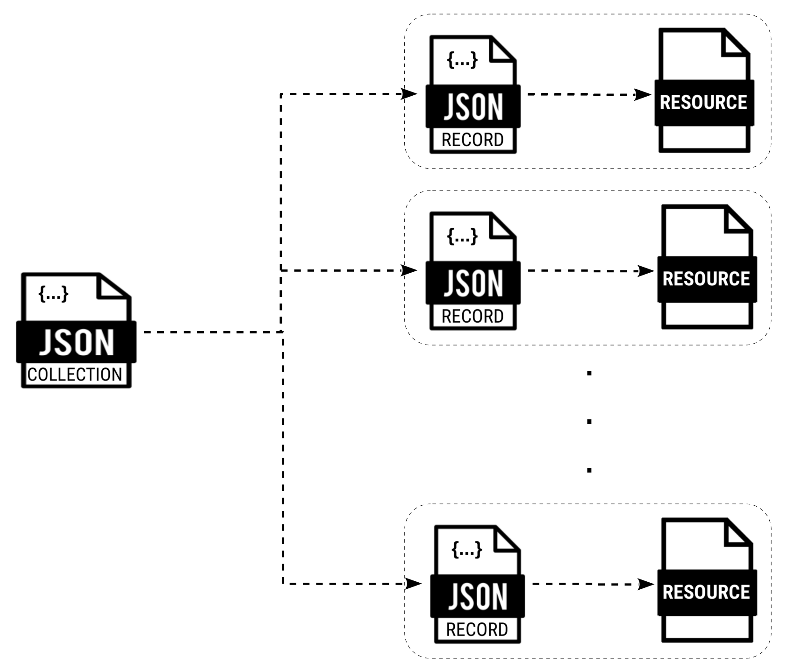

# OGC API - Records

## Using the standard

This GitHub repository contains the OGC API - Records for discovering geospatial information on the web. It focuses on a simple RESTful core specified as reusable [OpenAPI](http://openapis.org) components with responses in JSON and HTML.

The standard is on the OGC website:

* OGC API - Records - Part 1: Core
  * [Version 1.0.0](https://docs.ogc.org/DRAFTS/20-004r1.html)
  * Editor's draft [HTML](https://docs.ogc.org/DRAFTS/20-004r1.html) or [PDF](https://docs.ogc.org/DRAFTS/20-004r1.pdf).

Draft(s) are built daily based on the configuration contained in the [asciidoctor.json](https://github.com/opengeospatial/ogcapi-records/blob/master/asciidoctor.json) file.

[OGC API standards](https://ogcapi.ogc.org) define modular API common components to spatially enable Web APIs in a consistent way. [OpenAPI](http://openapis.org) is used to define the reusable API common components.

## Implementations

There have been several implementations of the draft standard, though they are
against different versions of the evolving draft:

* [Implementations of the draft specification / demo services](https://github.com/opengeospatial/ogcapi-records/blob/master/implementations.md)

## Overview

[OGC API standards](https://ogcapi.ogc.org) define modular API common components to spatially enable Web APIs in a consistent way. [OpenAPI](https://openapis.org) is used to define the reusable API building blocks.

OGC API - Records provides discovery and access to metadata about geospatial resources (e.g. data, services, ML models, etc.).  Having found a record describing a resource, binding information contained therein allows the discovered resources to be accessed.

### Components

#### Overview

The OGC API - Records specification being developed in this repository defines the following **common components**:

* Record Core
* Record Collection (Catalog)
* Record Core Query Parameters
* Records API
* Sorting
* Filtering
* Autodiscovery
* JSON encoding
* HTML encoding

⚠️ **These components are not independently implementable.  You can use these components to implement several types of catalogs [described below](#deployments).**

<a name="record-core"></a>
#### Record Core

The _**Record**_ is the atomic unit of information in a catalog.

A record provides a description (i.e. metadata) about a resource that the provider of the resource wishes to make discoverable.

The record common component defines the core schema of a catalog record.  It includes a small number of properties that are common across all resource types.  The following table lists the core set of record properties:

|Property |Requirement |Description 
|-----------|------------|-----------------------------------
|id |**M** |A unique record identifier assigned by the server.
|created |O |The date this record was created in the server.
|updated |O |The most recent date on which this record was changed.
|conformsTo |O |A list of identifiers indicating that the record conforms to one or more extensions. Ideally, the requirements of each listed extension is formally published.
|language |O |The natural language used for textual values (i.e. titles, descriptions, etc) of this record.
|languages |O |The list of languages in which this record can be requested.
|links |O |A list of links including links for accessing the resource (e.g. download link, access link, etc.) in one of the supported distribution formats, links to other resources associated with this resource and links for navigating the API (e.g. prev, next, alternate, etc.). See [link schema.](https://raw.githubusercontent.com/opengeospatial/ogcapi-records/master/core/openapi/schemas/linkBase.yaml).
|linkTemplates |O |A list of link templates related to this record.
|type |O |The nature or genre of the resource described by this record.
|title |O |A human-readable name given to the resource described by this record.
|description |O |A free-text description of the resource.
|geometry |O |A characteristic spatial extent associated with the resource; can be _null_ if not known or applicable.
|time |O |A characteristic temporal instance or interval associated with the resource; can be _null_ if not known or applicable.
|keywords |O |A list of free-form keywords or tags associated with the resource.
|themes |O |A knowledge organization system used to classify the resource.
|resourceLanguages |O |A list of languages in which the resource can be requested.
|externalIds |O |A list of identifiers for the resource assigned by one or more external entities.
|formats |O |A list of available distributions for the resource.
|contacts |O |A list of entities to contact about the resource.
|license |O |A legal document under which the resource is made available.
|rights |O |A statement that concerns all rights not addressed by the license such as a copyright statement.

It is anticipated that the schema of a record will be extended to describe specific resource types (e.g. data sets, earth observation products, services, machine models, etc.) and also extended by information communities wishing to enrich the information content of the record to suit their needs.  The specification does not mandate a specific encoding for a record but conformance classes are defined for encoding records as GeoJSON feature and HTML.

The following is an example of a catalogue record encoded as GeoJSON:

```
    {
      "id": "urn:uuid:dc9b6d52-932a-11ea-ad6f-823cf448c401",
      "type": "Feature",
      "time": null,
      "geometry": {
        "type": "Polygon",
        "coordinates": [ [ [ -117.35, 32.58 ], [ -117.35, 33.45 ],
                           [ -116.21, 33.45 ], [ -116.21, 32.58 ],
                           [ -117.35, 32.58 ] ] ]
      },
      "properties": {
        "updated": "2020-05-10T21:58:08Z",
        "type": "vector digital data",
        "title": "AG_PRESERVE",
        "description": "Agriculture Preserve Lands\nThe California Land Conservation Act, better known as the Williamson Act, has been the state's premier agricultural land protection program since its enactment in 1965. More than 16 million of the state's 30 million acres of farm and ranch land are currently protected under the Williamson Act. \n\nThe California Legislature passed the Williamson Act in 1965 to preserve agricultural and open space lands by discouraging premature and unnecessary conversion to urban uses. The Act creates an arrangement whereby private landowners contract with counties and cities to voluntarily restrict their land to agricultural and compatible open-space uses. The vehicle for these agreements is a rolling term 10-year contract (i.e., unless either party files a \"notice of nonrenewal,\" the contract is automatically renewed for an additional year.). In return, restricted parcels are assessed for property tax purposes at a rate consistent with their actual use, rather then potential market value.\nAn agricultural preserve defines the boundary of an area within which a city or county will enter into contracts with landowners. The boundary is designated by resolution of the board of supervisors (board) or city council (council) having jurisdiction. Only land located within an agricultural preserve is eligible for a Williamson Act contract. Preserves are regulated by rules and restrictions designated in the resolution to ensure that the land within the preserve is maintained for agricultural or open space use.",
        "keywords": [
          "Agriculture Presever",
          "Preserve Lands",
          "Ag Preserve"
        ],
        "language": "en-US",
        "externalIds": [
          {
            "value": "urn:uuid:dc9b6d52-932a-11ea-ad6f-823cf448c401"
          }
        ],
        "formats": [
          { "name": "vector digital data", "mediaType": "application/zip" }
        ]
      },
      "links": [
        {
          "href": "\\\\lueg-gis\\data\\dplu-projects\\20050909_williamson_ag\\shapefiles\\Williamson_agpreserve.shp",
          "rel": "enclosure"
          "type": "x-gis/x-shape"
        }.
        {
          "href": "https://demo.pycsw.org/gisdata/collections/metadata:main/items/urn:uuid:dc9b6d52-932a-11ea-ad6f-823cf448c401?f=json",
          "rel": "self",
          "type": "application/geo+json"
        },
        {
          "href": "https://demo.pycsw.org/gisdata/collections/metadata:main/items/urn:uuid:dc9b6d52-932a-11ea-ad6f-823cf448c401?f=html",
          "rel": "alternate",
          "type": "text/html"
        }
      ]
    }
```

<a name="record-collection"></a>
#### Record Collection (Catalog)

A record collection is an object that provides information about and access to a set of related records. Such a collection of records is also referred to as a catalog.

The `Catalog` component [extends](http://schemas.opengis.net/ogcapi/features/part1/1.0/openapi/schemas/collection.yaml) the information defined for a collection by [OGC API - Features - Part 1: Core](https://schemas.opengis.net/ogcapi/features/part1/1.0/openapi/schemas/collection.yaml) to:

* include additional metadata to enhanced the description of a catalog
* and, to provide links for accessing the records of the catalog.

|Property |Requirement   |Description 
|-----------------|------|-----------------------------------
|id               |**M** |A unique identifier for this catalog.
|created          |O     |The date this collection was created.
|updated          |O     |The more recent date on which this collection was changed.
|conformsTo       |O     |The extensions/conformance classes used in this catalog object.
|type             |**M** |Fixed value of "Collection".
|itemType         |O     |Fixed value of "record", "catalog" or both.
|title            |O     |A human-readable name given to this catalog.
|description      |O     |A free-text description of this catalog.
|extent           |O     |The spatiotemporal coverage of this catalog.
|crs              |O     |A list of coordinate reference systems used for spatiotemporal values.
|keywords         |O     |A list of free-form keywords or tags associated with this collection.
|themes           |O     |A knowledge organization system used to classify this collection.
|language         |O     |The language used for textual values (i.e. titles, descriptions, etc.) of this collection object.
|languages        |O     |The list of other languages in which this collection object is available.
|recordLanguages  |O     |The list of languages in which records from the collection can be represented.
|contacts         |O     |A list of contacts qualified by their role(s).
|license          |O     |The legal provisions under which this collection is made available.
|rights           |O     |A statement that concerns all rights not addressed by the license such as a copyright statement.
|recordsArrayName |O     |The name of the array property in the catalog used to encode records in-line. The default value is records.
|records          |O     |An array of records encoded in-line in the catalog.
|links            |**M** |A list of links related to this catalog.
|linkTemplates    |O     |A list of link templates related to this catalog.
|schemes          |O     |A list of schemes related to this catalog.

The records of a catalog are usually referenced using links in the `links` and/or `linkTemplates` sections.  

However, records may also be encoded in-line in a catalog using an array whose name is declared using the `recordsArrayName` property.  The default value of the `recordsArrayName` property is `records` which means that in-line records are (by default) encoded in the `records` array.

The following is an example of a searchable record catalog encoded as JSON:

```
{
  "id": "metadata:main",
  "title": "pycsw Geospatial Catalogue gisdata demo",
  "description": "pycsw is an OARec and OGC CSW server implementation written in Python",
  "links": [
    {
      "rel": "self",
      "type": "application/json",
      "title": "This document as JSON",
      "href": "https://demo.pycsw.org/gisdata/collections/metadata:main?f=json",
      "hreflang": "en-US"
    },
    {
      "rel": "alternate",
      "type": "text/html",
      "title": "This document as HTML",
      "href": "https://demo.pycsw.org/gisdata/collections/metadata:main?f=html",
      "hreflang": "en-US"
    },
    {
       "rel": "items",
       "href": "https://demo.pycsw.org/gisdata/collections/metadata:main/items"
    }
  ],
  "itemType": "catalog",
  "crs": "http://www.opengis.net/def/crs/OGC/1.3/CRS84",
  "keywords": [
     "Catalog","word2","word3","Ag Preserve"
  ],
  "language": "en-US",
  "updated": "2019-10-10T15:45:19Z",
  "publisher": {
     "individualName": "Joe Smith",
     "organizationName": "pycsw",
     "positionName": "developer",
     "contactInfo": {
       "phone": "+1555555555",
       "email": {
         "work": "joesmith@pycsw.org"
       }
     }
  },
  "license": "https://creativecommons.org/licenses/by/4.0/legalcode"
}
```

The following is an example of a crawlable record collection encoded as JSON.  In this case, it is a catalog of other catalogs of RADARSAT Earth observation products.

```
{
  "id": "radarsat-1",
  "title": "RADARSAT-1 Open Data",
  "description": "Launched in November 1995, RADARSAT-1 provided Canada and the world with an operational radar satellite system capable of timely delivery of large amounts of data. RADARSAT-1 used a synthetic aperture radar (SAR) sensor to image the Earth at a single microwave frequency of 5.3 GHz, in the C band (wavelength of 5.6 cm). This was a Canadian-led project involving the Canadian federal government, the Canadian provinces, the United States, and the private sector. RADARSAT-1 reached end of service on March 29, 2013. In order to download RADARSAT-1 datasets, credentials for the Earth Observation Data Management System are required.",
  "extent": {
    "spatial": [ -180, -90, 180, 90 ],
    "temporal": [ "1995-11-04T14:22:00Z", "2013-03-29T00:00:00Z" ]
  },
  "itemType": "catalog",
  "keywords": [ "sar", "eo", "radar", "radarsat", "canada" ],
  "language": "en-CA",
  "publisher": {
    "organizationName": "Canadian Space Agency (CSA)",
    "contactInfo": {
      "onlineResource": {
        "href": "http://www.asc-csa.gc.ca/eng/satellites/radarsat1/Default.asp"
      }
    },
    "role": {
      "name": "producer"
    }
  },
  "license": "proprietary",
  "properties": {
    "sar:platform": "RADARSAT-1",
    "sar:constellation": "RADARSAT",
    "sar:instrument": "C-SAR",
    "sar:frequency_band": "C",
    "sar:center_wavelength": 5.6,
    "sar:center_frequency": 5.3,
    "sar:polarization": [ "HH" ],
    "sar:observation_direction": "right"
  },
  "links": [
    {
      "href": "https://open.canada.ca/en/open-government-licence-canada",
      "rel": "license",
      "type": "text/html",
      "title": "license"
    },
    {
      "rel": "child",
      "href": "slc/collection.json"
    },
    {
      "rel": "child",
      "href": "raw/collection.json"
    },
    {
      "rel": "child",
      "href": "sgf/collection.json"
    },
    {
      "rel": "child",
      "href": "sgx/collection.json"
    },
    {
      "rel": "child",
      "href": "scn/collection.json"
    },
    {
      "rel": "child",
      "href": "scw/collection.json"
    }
  ]
}
```

<a name="record-core-query-parameters"></a>
#### Record Core Query Parameters

The Record Core Query Parameters component defines a minimum set of query parameters that should be implemented at a searchable catalog endpoint. The following table lists this set of query parameters.

The parameters bbox, datetime, limit and ids are inherited from OGC API Features - Part 1: Core. The remaining parameters are defined in this Standard.

|Parameter Name |Description 
|---------------|-----------------------------------------------------------
|bbox           |A bounding box. If the spatial extent of the record intersects the specified bounding box, then the record shall be presented in the response document.
|datetime       |A time instance or time period. If the temporal extent of the record intersects the specified date/time value, then the record shall be presented in the response document.
|limit          |The number of records to be presented in a response document.
|q              |A comma-separated list of search terms. If any server-chosen text field in the record contains 1 or more of the terms listed, then this record shall appear in the response set.
|type           |An equality predicate consisting of a comma-separated list of resource types. Only records of the listed type shall appear in the response set.
|ids            |An equality predicate consisting of a comma-separated list of record identifiers. Only records with the specified identifiers shall appear in the response set.
|externalIds    |An equality predicate consisting of a comma-separated list of external resource identifiers. Only records with the specified external identifiers shall appear in the response set.
|prop=value     |Equality predicates with any queryable not already listed in this table

<a name="records-api"></a>
#### The Records API

The OGC API - Records specification defines a core catalog access and search API by extending OGC API - Features - Part 1: Core APIs.

OGC API - Features specifies a well-defined access path to the records (i.e. `/collections/{collectionId}/items`) of a catalog (i.e. a record collection).  OGC API - Records extended each of these endpoints with additional query parameters to enable catalog search capabilities.

In the first case this allows deployments with a large number of collections to be searched as a sort of mini-catalogs of the deployment's resource collections (i.e. features, coverages, etc.).

In the latter case, this allows collections of records (i.e. catalogs) to be searched.

The search capabilities of the Records API are organized into various levels of complexity starting from simple spatial, temporal, keyword and type search predicates (i.e. `bbox=`, `datetime=`, `q=`, `type=`) that can be combined using a logical `AND` all the way up to a full blown predicate language (based on OGC API - Features - Part 3: Filtering and the Common Query Language (CQL)), that supports complex filter expressions of logically connected query predicates.

<a name="sorting"></a>
#### Sorting

The Sorting component defines the requirements for specifying how records in a response should be ordered for presentation.

The list of "sortables", that is the list of property names that can be used in a sorting expression can be retrieved from the `/collections/{catalogId}/sortables` endpoint of a Records API.

The "sortby" query parameter can be used to specify the sorting expression.  The default sort direction is ascending unless the property names specified in a "sortby" expression is prepended by a minus ("-") sign.  In this case, the sorting direction is descending.

````
.../collections/mycat/items?...&sortby=%2Dupdated,%2Bid&...
````

````
.../collections/mycat/items?...&sortby=%2Bextent&...
````

````
.../collections/mycat/items?...&sortby=%2Drelevance&...
````

A server can declare what the defaultsort order shall be using the `defaultSortOrder` property in the description of a catalog (i.e. in the `/collections/{catalogId}` document).

````
{
  .
  .
  .
  "defaultSortOrder": [
    {
      "field": "updated",
      "direction": "desc"
    },
    {
      "field": "area",
      "direction": "desc"
    }
  ],
  .
  .
  .
}
````

If no `defaultSortOrder` property is present then no particular order should be assumed when fetching records from the catalog.

<a name="filtering"></a>
#### Filtering

This component defines the binding to the filtering parameters (`filter`, `filter-lang`, `filter-crs`) defined in the [OGC API - Features - Part 3: Filtering](https://docs.ogc.org/DRAFTS/19-079r1.html#_requirements_class_filter) and the use of the [Common Query Language (CQL2)](https://docs.ogc.org/DRAFTS/21-065.html) as the query language.

````
properties.license LIKE 'https://creativecommons.org/licenses/%'
````

<a name="autodiscovery"></a>
#### Autodiscovery

The purpose of autodiscovery is, knowing the location of a web page, to find the addresses(s) of that page’s associated catalog(s). For example, a client could retrieve the landing page of an OGC API deployment, find the location of the site’s searchable catalog by locating the rel="http://www.opengis.net/def/rel/ogc/1.0/ogc-catalog" link in the landing page and then, using that catalog, search for resources offered by the site.

<a name="encodings"></a>
#### Encodings

The JSON and HTML components define the requirements for encoding records and catalogs in JSON or HTML.

<a name="deployments"></a>
## Catalog implementations

### Overview

There are a number of ways that records can be deployed as a "collection of records" or a catalog.  The OGC API - Records specification envisions three deployment patterns using the common components described above:

* a catalog deployed as a crawlable collection of records
* a catalog deployed as a searchable endpoint(s)
* a local resources catalog

:warning: In STAC the terms _static_ and _dynamic_ are used to describe these deployment patterns.  However, a _static_ catalog is not really static since additional records can be added at any time.  As a result, it was decided to try some different, more descriptive, terminology.  The terms _crawlable_ and _searchable_ have been proposed and are used in this README and in the OGC API - Records specification.  Other proposed terms include _basic_ and _searchable_.  The SWG decided to try out _crawlable_ and _searchable_ for now but these terms are subject to change based on feedback.

### Crawlable Catalog

|Component used |Obligation 
|---------------|----------
|[Record Core](#record-core) | mandatory
|[Record Collection (Catalog)](#record-collection) |optional
|[Autodiscovery](#autodiscovery) |optional
|[HTML and/or JSON encodings](#encodings) |optional

The crawlable catalog deployment pattern involves creating a file that contains a record that describes each discoverable resource.  Each file (i.e. record) is then deployed to some web accessible location (e.g. S3 bucket, web accessible directory, etc.), usually co-located with the resource the record is describing.  Sets of related records are identified by creating a _Catalog_ object, another file also deployed to some web accessible location.  The catalog object provides metadata about this collection of records and also includes hypermedia controls (i.e. links, one per record) that allow navigation to the records of the collection.

This deployment pattern imposes a very low implementation burden because it relies on HTTP to do most of the work of accessing the records of a catalog.  This makes it easy to deploy and to navigate to the records using a browser or by search engine crawlers.  However, complex searches using logically connect spatio-temporal and/or scalar predicates are not easily supported by this deployment pattern.



### Searchable catalog

|Component used |Obligation 
|---------------|----------
|[Record Core](#record-core) |mandatory
|[Record Collection (Catalog)](#record-collection) |mandatory
|[Records API](#records-api) |mandatory
|[Record Core Query Parameters](#record-core-query-parameters) |mandatory
|[Sorting](#sorting) |optional
|[Filtering](#filtering) |optional
|[Autodiscovery](#autodiscovery) |optional
|[HTML and/or JSON encodings](#encodings) |optional

As is the case for a crawlable catalog, in a searchable catalog deployment, records are created to describe discoverable resources.  Collections of these records, rather than being deployed into web-space, are typically (but not necessarily) stored in some back end data management system such as a NO-SQL database or an RDBMS and access to the records is provided through the Records API.  The API also makes use of hypermedia controls (i.e. links) that allow navigation to records in a manner similar to that in the crawlable deployment case.  Information about the catalog (i.e. the record collection) itself is also accessible through the API.

Unlike the crawlable deployment case, the API also provides search capability that allows subsets of records to be identified and accessed based on client-supplied criteria such as a bounding box, a data range or a free text search.  

The following examples illustrate accessing the catalog through the Records API:

```
GET /collections/DataCatalog
```

Get the description or metadata about a catalog with the identifier `DataCatalog` (i.e. the `DataCatalog` collection or records).

```
GET /collections/DataCatalog/items
```

Gets the first page of records from the `DataCatalog` catalog.

```
GET /collections/DataCatalog/items/rid001
```

Fetches a specific catalog record (with identifier `rid001`).

```
GET /collections/DataCatalog/items?bbox=160.6,-55.95,-170,-25.89
```

Searches the catalog for records that describe resources in the New Zealand economic zone.

```
GET /collections/DataCatal/items?34.5322,18.9328,41.6715,27.0956&datetime=2021-07-15/2021-08-08
```

Searches the catalog for records that describe resources from Greece between July 15th, 2021 and August 8th, 2021.

```
GET /collections/DataCatalog/items?34.5322,18.9328,41.6715,27.0956&datetime=2021-07-15/2021-08-08&q=burn,fire
```

Searches the catalog for records that describe resources from Greece between July 15th, 2021 and August 8th, 2021 and that contain the keywords `burn` and `fire`.

In all search cases, the response format is determined using standard [HTTP content negotiation](https://restfulapi.net/content-negotiation/).

Records are returned in pageable chunks, with each response containing a `next` link pointing to the next set of response records.  

### Local resources catalog

|Component used |Obligation 
|---------------|----------
|[Record Core](#record-core) | mandatory
|[Record Collection (Catalog)](#record-collection) |mandatory
|[Record Core Query Parameters](#record-core-query-parameters) |mandatory
|[Sorting](#sorting) |optional
|[Filtering](#filtering) |optional
|[Autodiscovery](#autodiscovery) |optional
|[HTML and/or JSON encodings](#encodings) |optional

The OGC API resource tree has a number of resource endpoints that represent lists of resources.  Some example endpoints include:

* `/collections` - list of collections offered by an OGC API
* `/processes` - list of processes offered by an OGC API
* `/collections/{collectionId}/scenes` - list of source scenes for a coverage or map

The OGC API - Records common components can be used to enable catalog-like queries at these endpoints.  This is especially useful if the endpoint can potentially have a very large number of sub-resources as might be the case at the `/collections` endpoint.  For example, the following request searches for collections whose spatial extent intersects a specified bounding box and whose temporal extent intersects a specified time period:

```
GET /collections?bbox=-69.64,37.76,-56.12,46.63&datetime=2020-01-11T00:00:00/2020-01-12T00:00:00
```

Only collections that satisfy that specified predicates are included in the response.

## Communication

Join the [mailing list](https://lists.ogc.org/mailman/listinfo/ogcapi-records.swg) or [](https://gitter.im/opengeospatial/ogcapi-records)

Most all work on the specification takes place in [GitHub issues](https://github.com/opengeospatial/ogcapi-records/issues), so browse there to get a good idea of what is happening, as well as past decisions.

## Additional Information

A non-normative document, the "OGC API - Records User's Guide", is planned.

The current expectation is to have a stable version of the Core specification in 2021. We want to wait for sufficient implementation feedback, mature implementations including a test suite, results from OGC testbeds and experience with draft extensions first.

* [Charter for this SWG](OGC_API_Catalogues_SWG_Charter.adoc)

## Contributing

The contributor understands that any contributions, if accepted by the OGC Membership and ISO/TC 211, shall be incorporated into OGC and ISO/TC 211 standards documents and that all copyright and intellectual property shall be vested to the OGC.

The OGC API - Records Standards Working Group (SWG) is the group at OGC responsible for the stewardship of the standard, but is working to do as much work in public as possible.

* [Open issues](https://github.com/opengeospatial/ogcapi-records/issues)
* [Proposing changes](https://github.com/opengeospatial/ogcapi-records/wiki/Propose-a-change-to-a-draft-of-a-CAT40-specification-document)
* [Copy of License Language](https://raw.githubusercontent.com/opengeospatial/ogcapi-records/master/LICENSE)

Pull Requests from contributors are welcomed. However, please note that by sending a Pull Request or Commit to this GitHub repository, you are agreeing to the terms in the Observer Agreement https://portal.ogc.org/files/?artifact_id=92169
