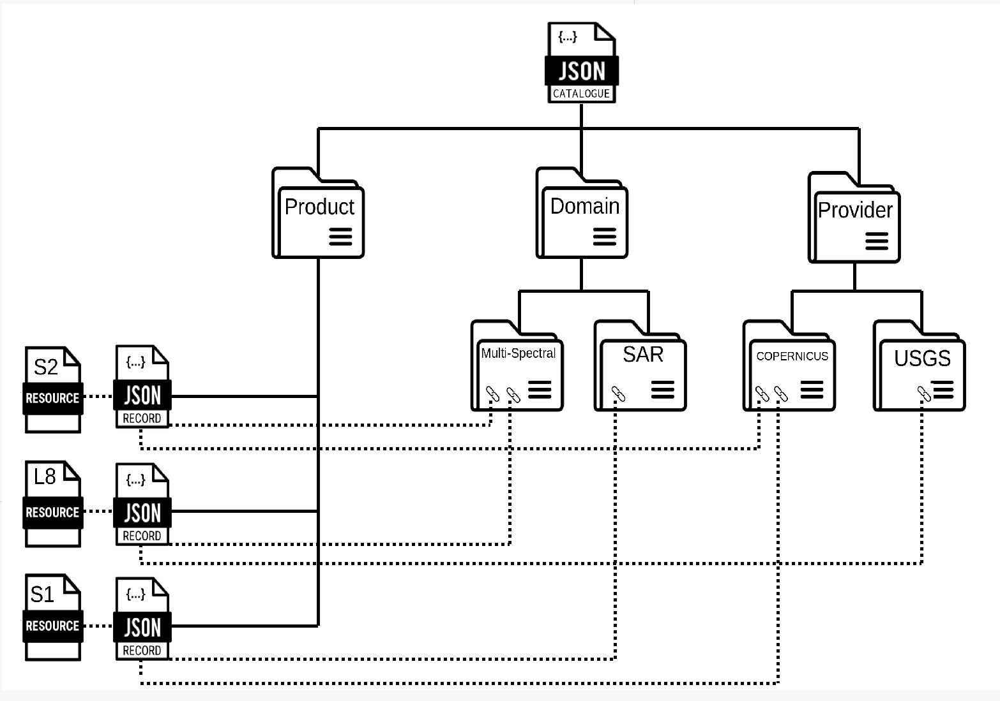

[[clause-crawlable-catalogue]]
== Requirements Class "Crawlable Catalogue"

[[crawlable-catalogue-overview]]
=== Overview

include::requirements/requirements_class_crawlable-catalogue.adoc[]

The `Crawlable Catalogue` Requirements Class defines the requirements for a catalogue composed of static, web-accessible files.

The goal of a crawlable catalogue is to expose metadata about resources online with as low an entry barrier as possible, thus making those resource more easily discoverable.

A crawlable catalogue is a deployment pattern that uses the <<clause-core-record-collection,collection>> and <<clause-record-core,record>> building blocks defined in this standard.  It is simply a set of files deployed on the web that encode, usually in HTML or JSON, the <<clause-record-collection,collection>> and <<clause-record-core,record schema>> defined in this standard.  The files contain embedded links to enable navigation from one to another.  Any HTTP server or cloud storage service, for example, could be used to expose the files of a crawlable catalogue.

A crawlable catalogue is not searchable and does not respond to query requests.  As the name implies, it can only be crawled (or harvested) by following the embedded links; typically by search engines and other active catalogues or browsed using a web browser.  However, due to its simplicity, a crawlable catalogue is easy to deploy and maintain, and is very reliable.

[[crawlable-catalogue-record]]
=== Making a resource discoverable

include::requirements/crawlable-catalogue/REQ_record.adoc[]

Attention is drawn to requirement <<per_core_additional-properties-record,/per/core/additional-properties-record>> that allows the information content of the record to be enriched as required to describe the resource being made discoverable.

include::requirements/crawlable-catalogue/REQ_record-links.adoc[]

include::requirements/crawlable-catalogue/REQ_record-file-location.adoc[]

include::recommendations/crawlable-catalogue/REC_record-file-name.adoc[]

include::recommendations/crawlable-catalogue/REC_record-file-location.adoc[]

For example, the record file could be placed in the same web-accessible directory or object store as the resource(s) that the record describes.

[[crawlable-catalogue]]
=== Grouping a collection of records into a catalogue

include::requirements/crawlable-catalogue/REQ_collection.adoc[]

include::requirements/crawlable-catalogue/REQ_collection-location.adoc[]

include::requirements/crawlable-catalogue/REQ_collection-links.adoc[]

=== Grouping catalogue resources into folders

In order to provide flexibility with regard to how crawlable catalogues can be organized (e.g. into a hierarchy) a <<clause-folder,_folder object_>> is defined (see: <<clause-folder>>) that may be used as a common entry point for crawling to multiple, related, sub-collections, catalogues, records and other resources.  The following figure illustrates the use of folders to organize a crawlable catalogue.

include::requirements/crawlable-catalogue/REQ_folder-location.adoc[]

include::recommendations/crawlable-catalogue/REC_folder-file-name.adoc[]

